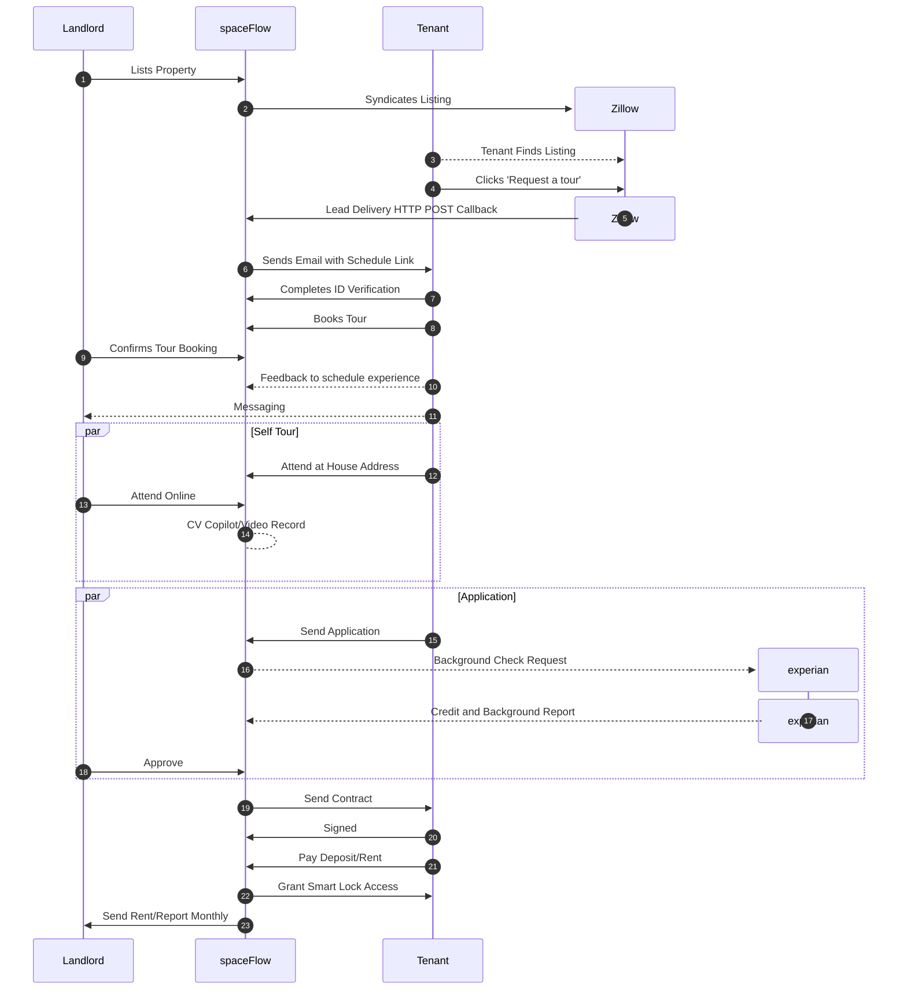
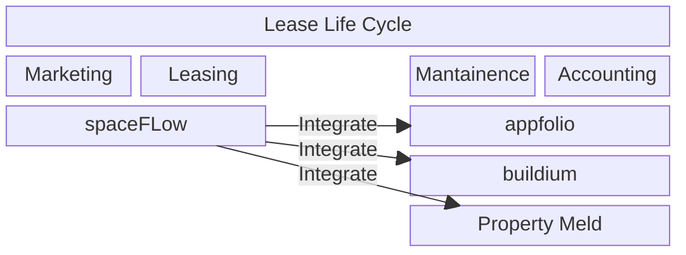

# spaceFlow
:point_right: https://tour.getspaceflow.com

| Activity                    | Tenant                                   | Landlord                                     |
| -----------------------     | ---------------------------------------- | -------------------------------------------- |
| [Add new room](https://www.youtube.com/watch?v=tDTK4_UgKfY&list=PLGDnJdf0olLXsGkfIsdQnCRQoQ6MwSE5s&index=4&t=68s&ab_channel=Sung-FuHan)                |                                          | ✅                                           |
| Add Smart Lock              |                                          | ✅                                           |
| Syndicate to Zillow         |                                          | ✅                                           |
| ID Verification             | ✅                                       |                                              |
| Credit Score Precheck       | <li> - [ ] </li>                         |                                              |
| Schedule Self Tour          | ✅ [Book](https://youtu.be/UOzoPsOO0no)  | ✅ [Approve](https://youtu.be/pFf5CD-o4cg)   |
| Feedback System             | <li> - [ ] </li>                         | <li> - [ ] </li>                             |
| Message System              | <li> - [ ] </li>                         | <li> - [ ] </li>                             |
| [Video Chat during Tour](https://youtu.be/lp7MuM7jdvM)     | ✅                                        | ✅ Remote Unlock Door                       |
| Video Tour Diary            | <li> - [ ] </li>                         |                                              |
| CV Tour Copilot             |                                          | <li> - [ ] </li>                             |
| CV Tour Autopilot           |                                          | <li> - [ ] </li>                             |
| Background Check            | <li> - [ ] </li>                         |                                              |
| Contract eSign              | <li> - [ ] </li>                         | <li> - [ ] </li>                             |
| Pay Deposit/Rent            | <li> - [ ] </li>                         |                                              |
| File Mantainance Ticket     | <li> - [ ] </li>                         |                                              |

## How spaceFlow works

## Videos
- How spaceFlow work? https://youtu.be/uyPxHJinf3w
- Supporting wide range of smart lock: https://youtu.be/lYC5LRvDqO4
- Landlord Step 1: Add Porperty https://youtu.be/8SAtHRkOXO4
- Landlord Step 2: Marketing Listing & Subscribe https://youtu.be/4Z3nVyaEdJ4
- Landlord Step 3: Approve/Decline a Tour https://youtu.be/pFf5CD-o4cg
- Landlord Step 4: Cloud Tour https://youtu.be/lp7MuM7jdvM
- Tenant Step 1 - Book a Tour (Phone, ID, Credit Card Verification) https://youtu.be/UOzoPsOO0no
- Tenant Step 2 - Reschedule/Cancel a Tour https://youtu.be/RyeQnMcewDs
- Tutorial Playlist: https://youtube.com/playlist?list=PLGDnJdf0olLXsGkfIsdQnCRQoQ6MwSE5s&si=ssTZZ9XWz-8pME7E

## Integration

## Short Intro

spaceFlow is a proptech with mission: to make remote property management a reality using IoT and computer vision (CV).

We understand that high-quality tenants are the backbone of a thriving rental market. At spaceFlow, we enable these tenants to enjoy an express rental experience, deserving of their status. Our platform offers a comprehensive one-time verification process, streamlining their journey from searching to settling into their new home with features like self-guided tours powered by IoT and computer vision, direct video communication with landlords, and swift application processes. This efficiency doesn't just attract tenants; it transforms them into invaluable assets for landlords, acting as reliable, single-unit property managers empowered by spaceFlow's maintenance system.

With just a few clicks to list a property and a monthly platform fee, landlord gain access to a pool of qualified tenants. Our automation platform will guide qualified tenants to handle the rest. Landlords can live anywhere.

Join us at spaceFlow, where we leverage cutting-edge technology to streamline the rental process, build strong landlord-tenant relationships, and pave the way for the future of remote property management. Transforming the rental industry, one property at a time. Invest in homes like stocks, earn dividends effortlessly.

## Target Audience

## Problem
- Extended rental house idle time due to schedule mismatch (42 days, Zumper)
- Trust Barriers Limiting Self-Tour
- No Access to Self-Tour Services for Small-Scale Landlords

## Solution
:point_right: Inclusive trustworthy Self-Tour Platform

How Inclusive?
- No demo
- No minimum doors
- Register and use it
- First property free

How Trustworthy?
- Computer Vision Copilot: Real-time oversight during self-tours
- ID Check
- Credit Score Precheck
- Tenant Credit Card Registration

With these features, we build trust between landlords and tenants.
Self-tours become the default option for every tenant during the rental journey.
Tenants rent a house quicker.
Landlords rent out their property faster.
The entire market becomes more efficient.

## How large is AI-IoT-enabled rental market? 50B 

### How large is self tour market? 1.5B/y
- 48.2M rental Units in US (source: US Census Bureau)
- 2023 Rental vacancy rate 6.5% (source: [US Census Bureau](https://www.census.gov/housing/hvs/data/prevann.html))
- Self-tour can shorten idle time by 0.5 month (source: Zumper)
- assume $1K/mo for each house
- Equation: 48.2M * 6.5% * 1k/mo * 0.5mo/y = 1.5665B/y

### How large is rental Comission market? 3.1B/y
- 48.2M rental Units in US (source: US Census Bureau)
- 2023 Rental vacancy rate 6.5% (source: [US Census Bureau](https://www.census.gov/housing/hvs/data/prevann.html))
- Comission fee 1 month
- assume $1K/mo for each house
- Equation: 48.2M * 6.5% * 1k/mo * 1mo/y = 3.133B/y

### How large is rental maintenance market? 45B/y
- 48.2M rental Units in US (source: US Census Bureau)
- 2023 Rental occupation rate 93.5% (source: [US Census Bureau](https://www.census.gov/housing/hvs/data/prevann.html))
- Comission fee 1 month
- assume $1K/mo for each house
- Equation: 48.2M * 93.5% * 1k/mo * 1mo/y = 45.067B/y

## Who will win?
- **Property Manager**: management power from 50 units to 500 units, 10 times thier comission/maintenance fee
- **Busy Landlords**: Rent house faster. Buy house just like buy stock, they all give dividends effortlessly.
- **Tenants**: One tour for all interested properties, rent dream house faster.
- **spaceFlow**: tour video can be used to reconstruct interior 3D model for future virtual tour

| Input Video | Output 3D Model Preview | 
|--------|--------|
|  |  |

## Self Tour Competitors
|                      |[spaceFlow](https://tour.getspaceflow.com)|[Rently](https://use.rently.com/)|[ShowMojo](https://hello.showmojo.com/)|[Tenant Turner](https://vimeo.com/438608478)|[Showdigs](https://www.showdigs.com/how-it-works)|[appfolio](https://www.appfolio.com/)|
|--------------------- |----------------------------------------- |-------------------------------- |-------------------------------------- |------------------------------------------- |------------------------------------------------ |------------------------------------ |
| Listing Syndiccation | ✅                                       | ✅                              | ✅                                    | ✅                                         | ❌                                              | ✅                                  |
| ID Verification      | ✅                                       | ✅                              | ❌                                    | ✅                                         | ❌                                              | ❌                                  |
| Tour Schedule        | ✅                                       | ✅                              | ✅                                    | ✅                                         | ✅                                              | ❌                                  |
| Smart Lock           | ✅ [General](https://tour.getspaceflow.com/smartlock)| ❌ [Limited](https://use.rently.com/smart-home/) | ❌ [Limited](https://hello.showmojo.com/mojolock/)  | ❌ [Limited](https://youtu.be/inDPtJIQxXg?si=Pf3p_hpBuGnCo-Xo) | ❌ Limited | ❌ |
| Self Tour            | ✅ Secure with CV                        | ❌ Blind                        | ❌ Blind                              | ❌ Blind                                   | ❌ Blind                                        | ❌                                  |
| Direct Use/No Demo   | ✅                                       | ❌                              | ❌                                    | ❌                                         | ❌                                              | ❌                                  |
| House Provider       | ✅ Landlord   ✅ Property Manager    | Property Manager                | Property Manager                      | Property Manager                           | Property Manager                                | Property Manager                     |
<!-- 
https://www.showdigs.com/showdigs-vs-the-competition
-->

## Press

## Back by

## Traction
- Adoption in Southern California
  - Customers manage over 300 properties.
  - 7 properties are actively using the self-tour service.

- Potential in South Dakota
  - Existing customer base with 300+ properties.
  - Opportunity for expansion of self-tour service.

## Team Intro

| Name                                                            | Major | Role | Background                                   |
| --------------------------------------------------------------- | ----- | -----| -------------------------------------------- |
| [Sung-Fu Han](https://www.linkedin.com/in/sungfuhan/)           | CS    | CEO  | 10y Landlord/SRE/ML Reseacher                |
| [Yi-Kai Liao](https://www.linkedin.com/in/yi-kailiao/)          | CS    | CTO  | 3y Tenant/Leetcode 1300 solved               |
| [Nelly Shih](https://www.linkedin.com/in/nellyshih/)            | HCI   | UX   | Yahoo UX/Struggle on real estate transparency|
| [Takuma Takezawa](https://www.linkedin.com/in/takuma-takezawa/) | CS    | SDE  | Airbnb Host                                  |
| [Simon Huang](https://www.linkedin.com/in/simon198/)            | IS    | SDE  | Web Developement Monster                     |

## Culture
- [Fight on](https://www.youtube.com/watch?v=RQ7oArZrQ1s&t=73s&ab_channel=CaliforniasGold)
- Perfection
- Diligence
- Curiosity
- Passion

## Design Principles
- SOLID
- DRY (Don't Repeat Yourself)
- KISS (Keep It Simple, Stupid)
- YAGNI (You Aren't Gonna Need It)
- Refactor Regularly

## Pitch Deck
- [Sheet](https://docs.google.com/spreadsheets/d/1BViheaBCrXD0x2fArpVnu0dqRzkXZJQ4UsFLsZ8C3Y8/edit?usp=sharing)
- [Slide](https://docs.google.com/presentation/d/1mOHJSB7zn1kANBHeg-8qv2BKCFXFBA6d_E6fMQoF3kk/edit?usp=sharing)

## Motivation

My name is Sung-Fu Han, and I've been a software engineer and part-time landlord in Taiwan for the past 10 years. I manage properties scattered across Taipei City, New Taipei City, and Kaohsiung. However, the challenges of in-person property tours have led me to embark on an exciting new venture.

Taipei's notorious traffic has proven to be a nightmare, making it a struggle to travel from one rental property to another. Even when I manage to arrive on time, tenants sometimes cancel the room tours for various reasons, leaving me feeling frustrated and inefficient.

To address this issue, I believe that in-person room tours are not only inefficient but also impractical, especially when landlords are not always available at the property. What if they're on vacation and a potential tenant wants a tour? That's when I had a revolutionary idea – self-guided tours! This would allow tenants to explore the property at their convenience without the need for me to be physically present.

However, I understand the safety concerns associated with self-tours, especially in well-decorated properties where the risk of damage or theft is higher. Installing web cameras to monitor the tours seems like a solution, but it introduces extra efforts, and tenants may worry about their privacy even after the cameras are removed.

To overcome these challenges, I'm introducing the "Zero Installation Self Tour." We ensure tour safety only depends on tenant's phone camera. During the tour, we kindly request tenants to grant permissions for their front and rear phone cameras. This enables us to stream the captured footage to an advanced AI-driven malicious event detection system, which aids in identifying any potential instances of missing or damaged objects. Moreover, the stream can also be utilized by tenants to provide evidence of their innocence if need.

But my vision doesn't stop there. I'm driven by a larger dream – to fully automate the entire rental process and turn renting a house into a genuine passive income stream. 

To achieve this, I will automate each part in rental life cycle. I've divided the rental process into three essential parts: before-contract, in-contract, and after-contract. Before-contract services involve recruiting the right tenants through self-tours, identity verification, background checks and eSign. In-contract features include monthly rent payment systems, and maintenance ticket system to address any issues promptly. After-contract includes credit system and room rollback service to ensure the property can rejoin listing automatically.

I firmly believe that automating the entire rental process is feasible, and self tour is last mile. It's surprising that there's no holistic solution available in the market yet. With this conviction, I've decided to take the lead and turn my vision into reality. My mission is to make entire rental process more efficent. Together, we'll make renting a house a true passive income.

I'm thrilled to show that despite not being typical young, university-dropout founder, I've taken the traditional route - completing my education and gaining years of work experience. Now, I'm ready to chase my dream and start my own company. This dream is a glowing ember within me, and with persistence, it will ignite into a blazing success!

## Q&A
**Q1: Why do you ask tenants to use their phones for a video tour instead of installing a camera in the room?**

A: There are several reasons for this approach. Firstly, having a camera in the room can make tenants feel insecure, a feeling that might persist during their stay. Using their phones, tenants can choose specific areas to focus on, and later compare these with other videos. This method also avoids the need for landlords to install additional equipment. Most importantly, it helps tenants feel safer and more in control of their privacy.

**Q2: Why prefer physical tours over virtual tours?**

A: Virtual tours like Matterport offer a great preview, but they fall short in capturing the essence of a property. Tenants often need to experience aspects like the neighborhood vibe, natural light, and feel of the space in person before making a commitment. That's why, despite the convenience of virtual tours, physical self-tours remain crucial for final decision-making.

**Q3: What is the different between spaceFlow and other property management software such as appfolio, doorloops, turbotenant and hemlane?**

A: spaceFlow distinguishes itself in the property management sector by prioritizing the rental experience of highly qualified tenants. While traditional software solutions cater to landlords and property managers, 50% property owners still choose self-management, indicating a gap that existing platforms do not address. spaceFlow believe qualify tenants deserve express rental experience. Qaulified tenants are who meet strict qualifications, including ID verification, credit card linkage, a credit score above 700, a clean criminal record, verified income, and no history of eviction. By focusing on these tenants, who are effectively single-unit property managers, spaceFlow enhances their autonomy, strengthening trust with landlords and facilitating remote property management. This shift to tenant-centered features promises to attract landlords by providing them the assurance of a responsible occupant and a hands-off management approach.

**Q9: How to make self tour everywhere?**

GPT: Making self-guided property tours available everywhere involves a combination of technology, security, and logistical planning. Here's a general strategy to achieve this:

1. Develop a Reliable Technology Platform: Create or utilize an existing platform that allows potential tenants to schedule and access properties without needing a physical agent present. This platform should handle scheduling, identity verification, and secure access.

2. Implement Secure Access Systems: Install smart locks or lockbox systems that can be controlled remotely. These systems should allow access only to verified individuals and at the scheduled times.

3. Identity Verification: Ensure that all users of the self-tour service undergo a robust identity verification process. This could include submitting government-issued ID and a current photograph, and possibly credit card information for security purposes.

4. Real-time Monitoring: Use technology like computer vision or real-time surveillance to monitor tours. This ensures safety for the property and can provide landlords with peace of mind.

5. Feedback and Reporting Mechanisms: After the tour, have an automated system to collect feedback or reports from the potential tenant. This can help in improving the experience and addressing any issues immediately.

6. Marketing and Partnerships: Collaborate with property listing sites, real estate agents, and property management companies to offer self-tour options as a part of their services.

7. Legal Compliance and Insurance: Ensure all activities comply with local real estate laws and regulations. Also, consider insurance to cover any liabilities that might arise from self-tours.

8. Customer Support: Provide excellent customer support to handle any issues, questions, or emergencies during the self-tour.

9. Continuous Improvement: Collect data and feedback to continuously improve the self-tour experience, security, and technology.

10. Scalability Plan: Have a clear plan for scaling the service, including expanding to new locations, managing increasing numbers of tours, and ensuring consistent quality and security as you grow.

Implementing self-tours everywhere is a complex task that requires careful consideration of security, technology, and user experience, but with the right approach, it can significantly enhance the property rental process.

## Tech Stack

| Frontend      | API        | Backend        | DB              | Cloud          |
| ------------- | ---------- | -------------- | --------------- | -------------- |
|    |   |   |  |  |

<!-- 

 Mail
wallinslax@gmail.com
kevinliao75@gmail.com
yushih0729@gmail.com
t.t.yeah.b5@gmail.com
c121549443@gmail.com

## Progress

|Rental Lifecycle | Before-contract | In-contract | After-contract | 
|-|-|-|-|
|Porjects| Frontier Map Search :fire:    ID Check   Self Tour :fire:   Background Check   eSign | Pay Rent System   Maintainence Ticket System   Tenant Web App   Landlord Web App :fire: | Credit System |

## Domain 
[spaceflow.in](https://www.spaceflow.in)

> [spaceflow.io](https://spaceflow.io) is taken by a [real estate company](https://www.linkedin.com/company/spaceflow/?originalSubdomain=cz) in Prague which has the similar mission with us. However, they focus on in-contract management. On the other hand, we focus on entire rental life cycle.

## Design Story - Cloud Tour
Let take Airbnb website as a role model.

Think you are a tenant and is searching for a room to rent at least 3 month or longer.

### A. you searching for a location and see many rooms

### B. you pickup a place that close to your company and detail page shows

### C. you want to have a room tour so you click "book a room tour" button

> Our works start from this button

### D. User Experience Flow
The purpose of this document is to outline the design for building an entire tour experience starting from a button. The tour experience includes creating a unique room tour transaction, embedding the tour link in Google Calendar, confirming the tour, granting necessary permissions, matching GPS location, unlocking the smart lock, conducting the tour, detecting malicious events through AI, and completing the tour with a credit increase.

#### 1. Creating a Unique Room Tour Transaction
- When a tenant selects a valid time provided by the landlord in Calendly, a unique room tour transaction should be created in the Firebase Realtime Database.
- The transaction should include relevant details such as the tenant, landlord, tour time, and room information.
- The unique room tour link should be embedded in the tenant and landlord's Google Calendar, ensuring easy access for both parties.

#### 2. Confirmation and Permission
- At the scheduled tour time, the tenant should physically arrive at the location.
Using their phone, the tenant opens the unique tour link in the web app, which leads to the confirmation page.
- The web app requests permission to access the GPS, front camera, and rear camera of the tenant's device.
- Granting these permissions is necessary for security purposes and to proceed with the room tour.

#### 3. GPS Location Match and Smart Lock Unlock
- Once the landlord is online, the web app checks if the tenant's GPS location matches the location recorded in the transaction.
- If the GPS location matches, the smart lock associated with the room will be unlocked, signaling the start of the room tour.

#### 4. Room Tour Process
- During the tour, the tenant can ask questions to the landlord or an online agent for assistance.
- The video stream from the tenant's device will be sent to an AI server for detecting any malicious events, such as stealing or breaking something.
- The AI server analyzes the video stream in real-time and alerts appropriate parties if it detects any suspicious activities.

#### 5. Tour Completion and Credit Increase
- When the room tour is completed, the smart lock will automatically lock the room.
- If there are no security issues detected during the tour, the tenant's credit will increase by a certain amount as a reward for completing the tour.

Note: This design document provides a high-level overview of the room tour experience. Implementation details, technical specifications, and security measures should be further defined during the development process. 

-->

